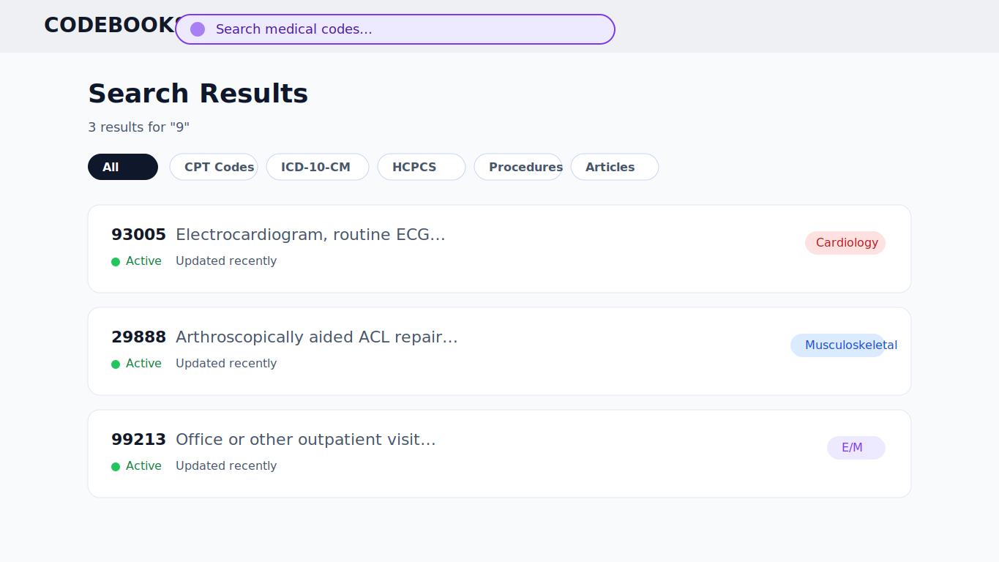
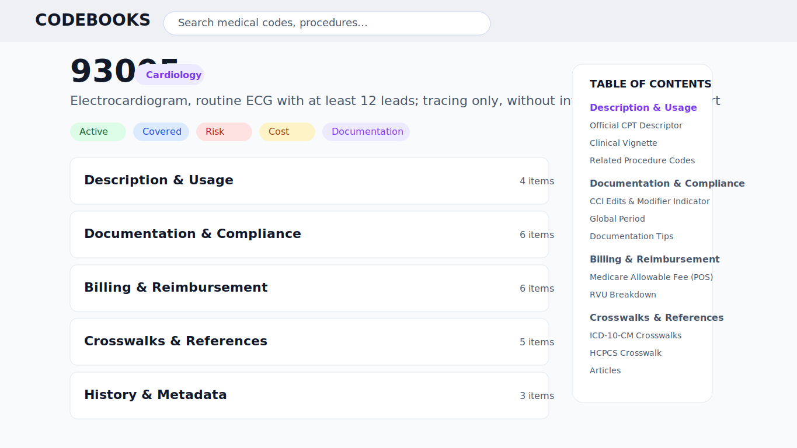
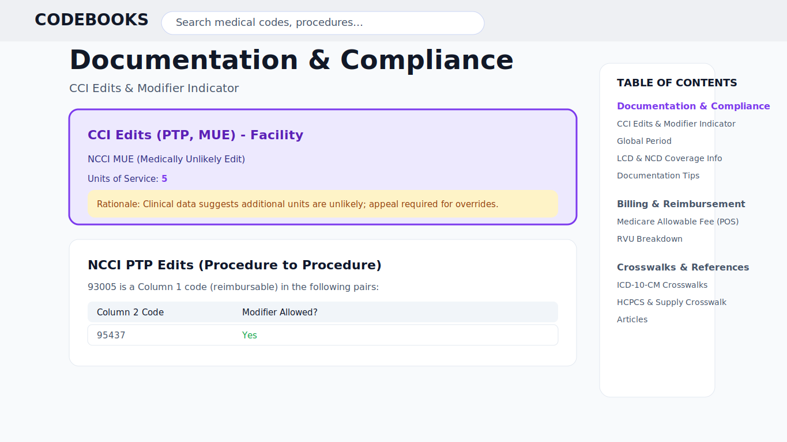

# CodeBooks

CodeBooks is an interactive reference experience for medical billing and coding teams. It centralizes CPT, ICD, and related procedure information in a polished UI that combines faceted search, expandable navigation, and rich detail panes so reviewers can move through documentation with confidence.

## Features
- Unified landing page that surfaces recently viewed codes, featured categories, and saved favorites for fast orientation.
- Context-aware search with category filters (CPT, ICD-10-CM, HCPCS, Procedures, Articles) and inline result counts.
- Hierarchical code explorer with expand/collapse controls and a synchronized table of contents for detailed reading.
- Rich code detail view displaying clinical summaries, billing guidance, payer policies, documentation checklists, and FAQs.
- Embedded CodeBooks Chatbot for quick Q&A support directly inside the workspace.

## Screenshots
- **Search Results** – Powerful filters and inline status chips keep the team focused:
  
- **Code Overview** – Accordion layout summarizes documentation, billing, and compliance workstreams:
  
- **Compliance Insights** – Highlighted NCCI edits clarify modifier rules and payer expectations:
  

> Tip: Update the assets in `public/screenshots/` as you capture new UI states.

## Getting Started
### Prerequisites
- Node.js 18+
- npm (bundled with Node.js)

### Installation
```bash
git clone https://github.com/vmiholia/codebook-tab-builder.git
cd codebook-tab-builder
npm install
```

### Development
```bash
npm run dev
```
This starts the Vite development server (defaults to `http://127.0.0.1:5173`).

### Build & Preview
```bash
npm run build   # Create a production build in dist/
npm run preview # Serve the production build locally
```

### Linting
```bash
npm run lint
```
Runs ESLint across the project using the shared configuration in `eslint.config.js`.

## Project Structure
- `src/pages/Index.tsx` – Landing page that orchestrates global search, filters, and navigation.
- `src/components/CodeDetailPage.tsx` – Primary detail view for procedure information, payor guidance, and documentation assets.
- `src/components/NavigationOverlay.tsx` – Overlay navigation for quickly jumping between grouped codes.
- `src/components/RCChatBot.tsx` – CodeBooks support assistant embedded as a floating widget.
- `src/data/` – Static seed data powering the demo experience (e.g., `cpt93005.ts`).
- `public/` – Static assets including favicon, exported reference documents, and UI imagery.

## Tech Stack
- React 18 with TypeScript and Vite
- shadcn/ui and Radix primitives for accessible UI components
- Tailwind CSS for styling with `tailwind-merge` and `clsx`
- TanStack Query for lightweight client-side state and data fetching patterns

## Contributing
1. Fork the repository and create a feature branch.
2. Make your updates and add tests or screenshots as appropriate.
3. Run `npm run lint` and `npm run build` to verify changes.
4. Submit a pull request describing the enhancement or fix.

## License
This project is proprietary to CodeBooks. Please contact the repository owner for usage questions or collaboration requests.
